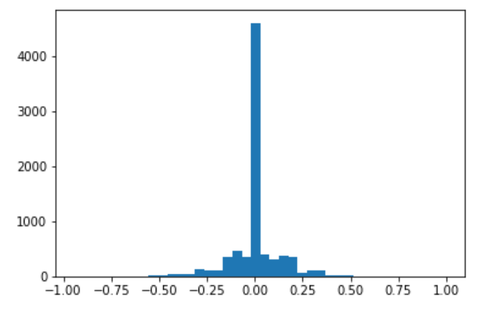
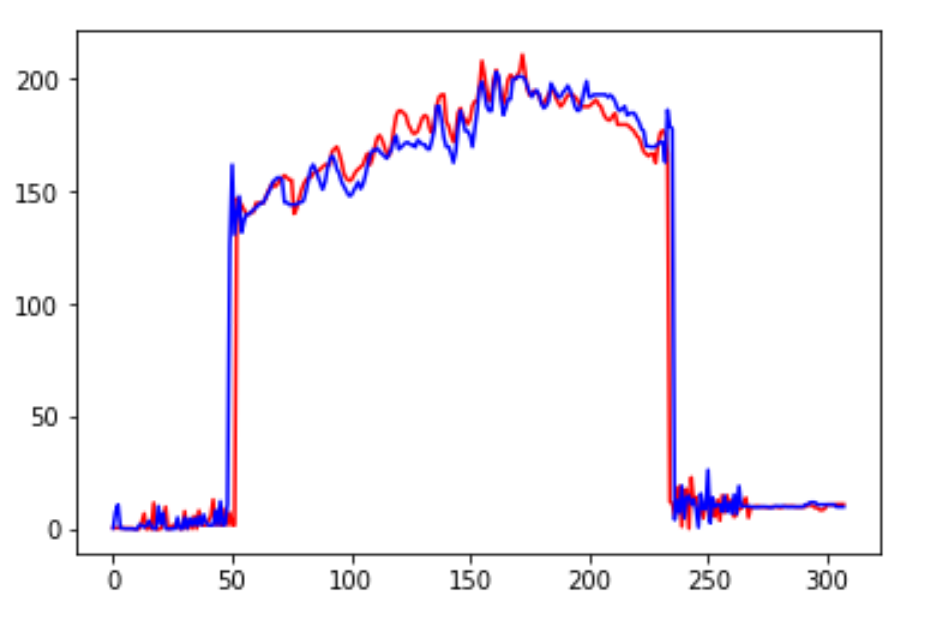
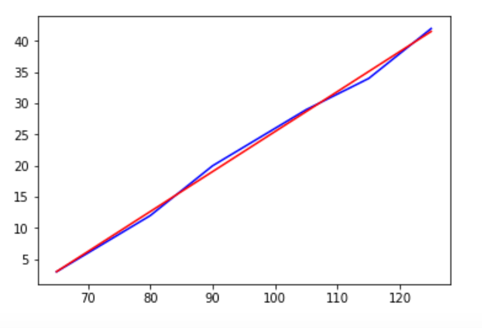
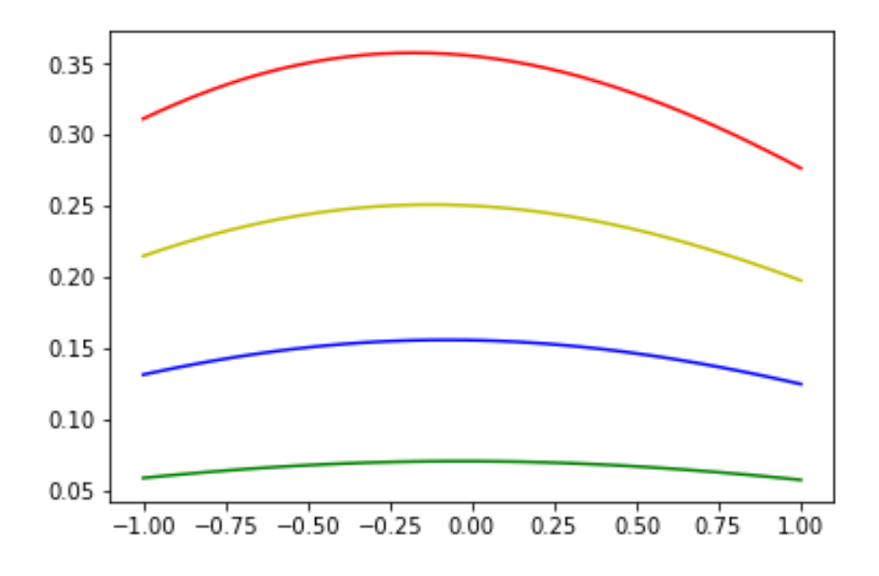
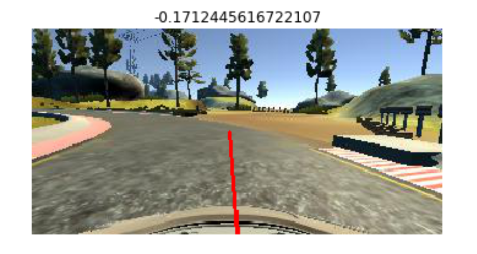

#**Behavioral Cloning** 

The goal of this project is to teach a neural network to drive a car in a simulator.  The data takes the form of camera images from the windshield of the car and the current steering angle.  From this data, the neural network will learn to predict steering angles given new camera images.

For this project I took it as a challenge to only use the Udacity supplied data and not create additional data.  The Udacity data is taken as the car drives around the track clockwise, while we want the car to learn to drive around the track counter-clockwise.  Thus the neural network cannot simply "memorize" the images and correct steering angles and will have to generalize to driving in a different direction.

Another challenging aspect of the Udacity data is that it is taken (I believe) from a keyboard.  There are many 0 steering angle entries in the data and sharp spikes of larger steering angles.

I include a jupyter notebook data_pres.ipynb and an html version data_pres.html that includes my data exploration in more detail and how I arrived at the various preprocessing and data augmentation steps.

## Preprocessing
We cropped off the first 55 rows of the image to remove the portion above the road and the bottom 25 rows of the image with the hood of the car.  This left us with an image of size 80-by-320.  We then resized this image to 16-by-64 (preserving the aspect ratio).  We did not find an advantage to using larger images and with the smaller size the images could be stored in memory and the model trained faster.  

These preprocessing steps are done in the file make_dataset.py which saves the preprocessed images and steering measurements as numpy arrays, which are later loaded in the model file keras_model.py.

## Data Augmentation
I started out using only the center camera images from the Udacity data set.  A car trained from these images drove very smoothly on the straight portions of the road, but did not steer hard enough in corners and would drive off the road.  

This is probably because the center camera data is dominated by zero steering angles.  Out of the 8036 steering measurements, only 4452 have a steering angle greater than 0.01 in absolute value.

Next I added the left and right camera images in the dataset.  A key problem with adding these images is to determine what the steering angle should be for the image from the left image given the steering angle for the center image.

I spent substantial time on this problem, thinking it to be key to developing a car that drives well.  My approach was to look at a particular pixel in the center image and determine where this pixel appears in the left camera image.  In doing this we could determine the "pixel shift" from the center to the left camera image.

Here is an example of how we matched pixels from a row of the center image to those of the corresponding row of the left image.  We choose a shift wo that the peaks and valleys of the red and blue lines match up.

Interestingly, the pixel shift is dependent on what row the pixel is in.  This makes sense: distant objects like trees do not change their relative position when we take a step to the left; however, objects close to us will shift their position dramatically when we take a step to the left.

We determined the pixel shift as a function of the row number (this approach is detailed in data_pres.ipynb).  Interestingly, the pixel shift was fit very well by a linear function in the row number!

The blue line is what we found empirically, and the red line is a straight line.

With this computation we could determine the shift of any pixel in the center camera to the left camera image.  We then assumed that the driver had a focal point, a point in the distance that he was driving towards.  We found this point in the center image, and then could find where this same point appears in the left image, using the pixel shift.  This allowed us to compute the new steering angle for the left image.

Unfortunately, this computation depends upon how far in the distance the focal point is.  Here is a plot of the left camera angle as a function of the center camera angle for different values of the focal point distance.

As the focal point becomes further away, the pixel shift becomes smaller and thus the steering angle between the left camera and center camera is closer together.

We tried out several different values of the "focal distance" to see which one worked the best.  The effect of the steering offset for the left and right camera images also depends on the neural network model, which we come to next.

## Model
The eventual model I settled on is as follows:

1) Lambda layer preprocessing (lambda x: (x / 255.0) -0.5)

2) 1x1x1 convolution.  This lets the network learn a transformation from RGB color space into one color channel.

3) 3x3x16 convolution with relu activation.  We use 3x3 size filters to keep spatial resolution.  We tried a larger number of filters but they did not improve the driving of the car.

4) A dense layer of 128 neurons.  This layer is by far the largest of the network with 1,777,792 parameters.

5) Another dense layer of 128 neurons.

6) Output layer of one neuron.

The total number of parameters is 1,794,597.

We used mean squared error as our loss function and trained the model using the ADAM optimizer.  

We used a validation set of 20% of the training set to evaluate the generalization of the model.  The model began overfitting very quickly and often times the best validation loss was achieved after just one epoch.  Thus we ultimately chose to train the model for only one epoch using the full training set.

We experimented with dropout but did not find it to improve the driving ability of the model.  We also experimented with a maxpooling layer after the convolutional layer but did not find it improved the driving quality either.

## Model Choice
A big obstacle throughout this project was the tension between driving well on the straight portions of the road and driving well on corners.  We initially tried a more "traditional" network consisting of three intitial 3x3 convolutional layers.  When this model was trained with the 3 camera angle data set it drove well through corners, but had a "zig zag" behavior on the straight roadways, continuosly overcorrecting its steering angle and weaving from one side of the road to the other.  This zig zag behavior was a major problem and would sometimes send the car out of control.

Eliminating these convolutional layers was a big breakthrough in my process.  The current model given above with only one 3x3 convolutional layer behaved much better on straight roadways.  One can still see some of the zig zag behavior in the video, but it is less pronounced than my earlier models, and does not send the car out of control.  

When I added more data, including left-to-right flipped images of all images in the data set, this again led to more zig zag behavior.  Thus ultimately I just used the center, left, and right camera images.

## Offset Choice
I was able to get a working model with the steering offset for the left and right camera images using the fancy formula given by the yellow line in the plot above.  However, the model also worked just using a constant offset of +0.2 for the left camera and -0.2 for the right camera.  In the interest of simplicity, I just went with this constant offset choice.

## Predictions
The most difficult curve in my training process was the sharp left turn after the bridge with the dirt road going off to the side.  Although the Udacity data set drives clockwise around the track, it does contain a few images of this curve at the very beginning of the dataset.  Unhelpfully, though, the steering angles on these images are all zero.

Let's see how our model manages to go around this curve!

This image is from the Udacity data set, where the steering angle is 0.  Our model, however, predicts -0.17, a reasonably large negative angle which translates to about -4.25 degrees.  Well done model!
